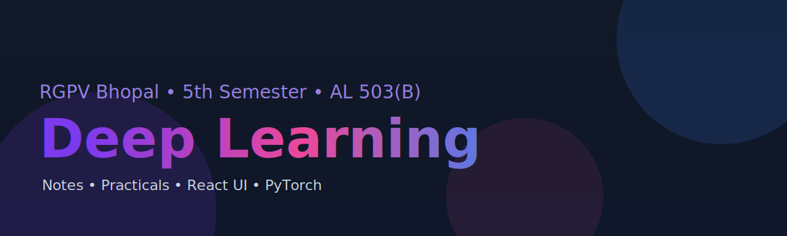

# Deep Learning (AL 503(B)) – RGPV Bhopal (5th Semester)

<p align="center">
	
</p>

<p align="center">
	<a href="https://github.com/UmeshCode1/deep-learning-5th-sem-rgpv/actions/workflows/deploy-ui.yml">
		
	</a>
	<a href="https://github.com/UmeshCode1/deep-learning-5th-sem-rgpv/actions/workflows/ui-build.yml">
		
	</a>
</p>

> Deployed site (after first successful run): https://umeshcode1.github.io/deep-learning-5th-sem-rgpv/

### Developed by: Umesh Patel  
#### Vice President — AI & Machine Learning Club, OCT  
#### Under guidance of: Department of Computer Science & Engineering (AI & ML)

> This repository is part of the official coursework for the 5th Semester subject  
> **Deep Learning (AL503B)** under **RGPV, Bhopal**, following the **AICTE Flexible Curriculum**.

---

Rajiv Gandhi Proudyogiki Vishwavidyalaya, Bhopal
Departmental Elective – Deep Learning

New Scheme Based on AICTE Flexible Curricula
Course Code: AL 503(B)

## 🎯 Course Objectives

To introduce deep learning fundamentals and major algorithms, the problem settings, and their applications to solve real-world problems.

## 🧠 Course Outcomes

- Describe deep learning theories, fundamentals, and techniques.
- Identify on-going research in computer vision and multimedia.
- Evaluate deep networks using performance metrics.
- Design and validate deep neural networks as per requirements.

## 🧩 Unit-wise Syllabus

- Unit I: History of Deep Learning, McCulloch-Pitts Neuron, MLPs, Backpropagation, PCA, SVD
- Unit II: Gradient Descent Variants, Autoencoders, Variational Autoencoders
- Unit III: CNNs – LeNet, AlexNet, VGG, ResNet, GoogLeNet, Regularization
- Unit IV: RNN, LSTM, GRU, Attention, NLP & Video Analytics
- Unit V: RBMs, DBNs, GANs, Generative Models and Applications

## 🔬 Practicals

- Implement MLP using NumPy/PyTorch
- Autoencoder on MNIST
- CNN on CIFAR-10
- RNN/LSTM for Text Generation
- GAN for Synthetic Image Generation

Each notebook includes:
- Objective
- Theory explanation
- Code implementation
- Output visualization
- Summary

## 🧾 Assignments

Unit-wise assignments with theory + hands-on tasks are available in `assignments/`:

- Unit 1 — Foundations, MLPs, PCA → `assignments/unit1.md`
- Unit 2 — Optimization & Autoencoders → `assignments/unit2.md`
- Unit 3 — CNN Architectures → `assignments/unit3.md`
- Unit 4 — RNNs, LSTM, Attention → `assignments/unit4.md`
- Unit 5 — Generative Models & GANs → `assignments/unit5.md`

Expected outputs for each practical are summarized under `practicals/outputs/`.

## ✨ Features

- Responsive React UI (Vite + Tailwind) with subtle 3D effects and gradients
- Light/Dark theme toggle with localStorage persistence
- Clean navigation: Syllabus, Practicals, Assignments
- Jupyter notebooks with runnable PyTorch examples for P1–P5
- CI pipeline (build) and GitHub Pages deploy via Actions
- SPA routing fallback (`404.html`) for GitHub Pages
- Unit-wise assignments and expected outputs for quick evaluation

## 🗂️ Repository structure (high-level)

```
deep-learning-5th-sem-rgpv/
├─ assignments/            # Unit-wise assignment sheets
├─ notes/                  # Unit notes (theory + labs)
├─ practicals/             # Jupyter notebooks + outputs summaries
├─ datasets/               # Dataset pointers/instructions
├─ syllabus/               # Official syllabus and summaries
├─ ui/                     # React + Vite + Tailwind front-end
├─ .github/workflows/      # CI and Pages deploy
├─ assets/                 # Banner and static assets
├─ requirements.txt        # Python dependencies
└─ README.md               # This file
```

## 🧠 Developer Details

**Name:** Umesh Patel  
**College:** Oriental College of Technology, Bhopal  
**University:** Rajiv Gandhi Proudyogiki Vishwavidyalaya, Bhopal  
**Branch:** CSE (Artificial Intelligence & Machine Learning)  
**Semester:** 5th  
**Course Code:** AL 503(B)  
**Subject:** Deep Learning  

---

## 🏗️ Project Vision

This repository was created to provide an **interactive and well-documented** learning environment for Deep Learning as per the RGPV syllabus — combining theory, practicals, and real-world project demonstrations through:
- Organized notes & syllabus breakdown  
- Implemented practicals with Jupyter notebooks  
- Responsive React UI with 3D effects for easy navigation  
- Reference datasets and research materials  

---

## 📬 Contact

For queries, collaborations, or club events:
📩 **Email:** umesh.code1@gmail.com  
🌐 **AnantreX Community:** [Join Here](https://chat.whatsapp.com/FjcQN6dyIotISFbxoizoom)  
💼 **LinkedIn:** [Umesh Patel](https://www.linkedin.com/in/umesh-patel-5647b42a4)  
📸 **Instagram:** [nycto_phile.i](https://www.instagram.com/nycto_phile.i)  

---

## 📚 References

1. Ian Goodfellow, Yoshua Bengio, Aaron Courville – _Deep Learning_ (MIT Press)
2. François Chollet – _Deep Learning with Python_ (Manning)
3. Charu C. Aggarwal – _Neural Networks and Deep Learning_ (Springer)
4. Aurélien Géron – _Hands-On ML with Scikit-Learn & TensorFlow_ (O'Reilly)
5. Adam Gibson, Josh Patterson – _Deep Learning: A Practitioner's Approach_ (O'Reilly)

## 🧰 Tools & Tech

- Python 3.10+ (developed and tested with modern Python; PyTorch preferred)
- PyTorch (primary), TensorFlow (optional if environment supports)
- Matplotlib, NumPy, Pandas
- React + TypeScript + TailwindCSS + Vite
- VS Code / Jupyter Notebook

## ⚙️ How to Run

### Quick Start (Python + Jupyter)

1. **Create and activate virtual environment:**

```powershell
python -m venv .venv
.\.venv\Scripts\Activate.ps1
```

2. **Install dependencies:**

```powershell
pip install -r requirements.txt
```

3. **Launch Jupyter Notebook:**

```powershell
jupyter notebook
```

4. **Open notebooks** from the `practicals/` folder

### UI Setup (React + Vite)

#### **Option 1: Use Helper Script (Recommended)**

```powershell
.\run-ui.ps1
```

Or for Command Prompt:
```cmd
run-ui.bat
```

#### **Option 2: Manual Setup**

1. **Restart your terminal** (to load Node.js in PATH), then:

```powershell
cd ui
npm install
npm run dev
```

2. **Open browser:** http://localhost:5173

📖 **See [SETUP_GUIDE.md](SETUP_GUIDE.md) for detailed instructions and troubleshooting.**

## 🧪 Practicals Folder Details

Each practical includes:
- Markdown cell for concept
- Code cell for model training
- Visualization section (plots, accuracy graphs)
- Commented code for easy learning

## 📘 datasets/

Contains sample dataset download instructions for MNIST, CIFAR-10, and IMDB.

## 💻 UI DETAILS

- `Navbar.tsx`: Navbar with links (Syllabus, Practicals, Assignments) + theme toggle
- `SyllabusView.tsx`: Displays syllabus in card format
- `PracticalsView.tsx`: Shows notebook links
- `AssignmentsView.tsx`: Unit-wise assignment cards

Academic theme with RGPV and AI&ML branding at top.

## 🚀 Deployment (GitHub Pages)

This repo ships with a Pages workflow. One-time setup required:

1) In GitHub → Settings → Pages → Build and deployment → set Source to “GitHub Actions”.
2) Re-run the latest "Deploy UI to GitHub Pages" workflow or push a new commit.

Details: see `docs/DEPLOY_PAGES.md`.

## 🔗 Quick links

- Live site: https://umeshcode1.github.io/deep-learning-5th-sem-rgpv/
- Setup guide: `SETUP_GUIDE.md`
- Features: `docs/FEATURES.md`
- Deploy to Pages: `docs/DEPLOY_PAGES.md`
- Quick start: `QUICK_START.md`
- Status & notes: `STATUS.md`
- Repo About (description/website/topics): `docs/REPO_METADATA.md`

## ⚙️ Additional Files

- `.gitignore` (ignore node_modules, pycache, .ipynb_checkpoints)
- `requirements.txt` (tensorflow, torch, matplotlib, numpy, pandas)
- `LICENSE` (MIT)

---

This repository was scaffolded to follow the AICTE Flexible Curricula for CSE – Artificial Intelligence and Machine Learning (V Semester) and adapted for the RGPV syllabus for Deep Learning (AL 503(B)).
